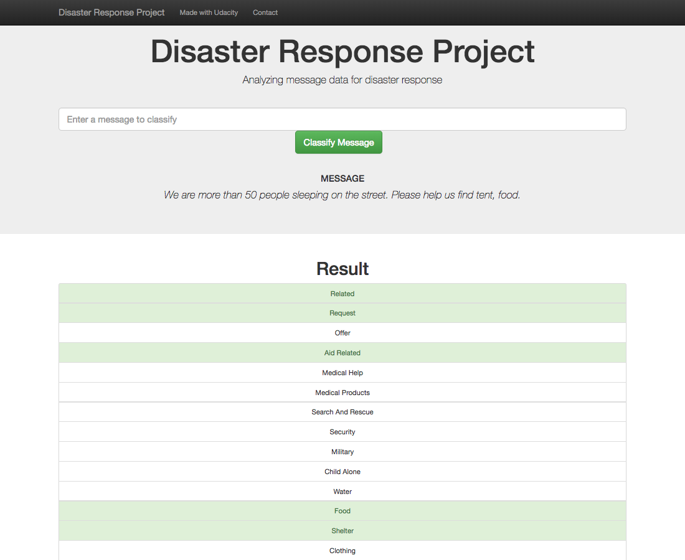
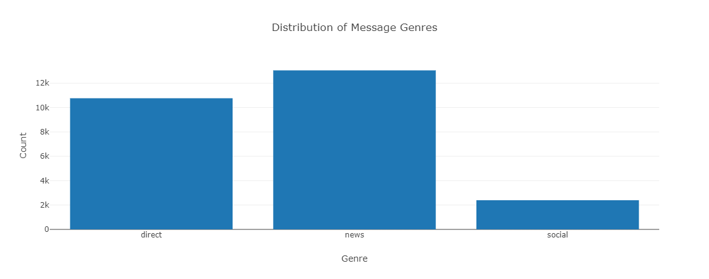
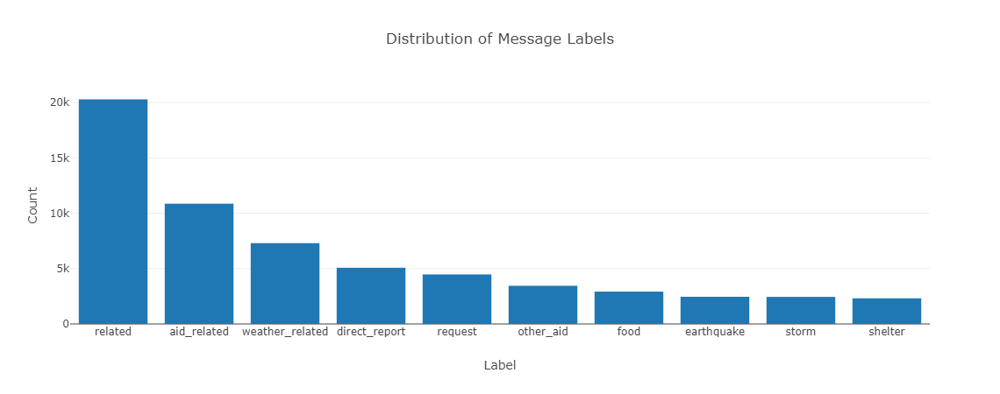

# Disaster Response Pipeline Project

### Project Summary
Natural disasters often lead to an overwhelming influx of messages seeking assistance, making it challenging for emergency workers to efficiently categorize and respond to each one. The Disaster Response Project is designed to address this issue by creating a machine learning pipeline capable of categorizing real-time messages from disaster events. Through the development of a web app, emergency workers can input new messages and receive accurate and timely classification results across multiple categories.

## Key Features
Machine Learning Pipeline: The project incorporates a robust machine learning pipeline that processes and classifies messages into various categories, ensuring a rapid and accurate response.

Web App Interface: An intuitive web app provides a user-friendly interface for emergency workers to input new messages. The app then displays classification results for quick decision-making.

Visualizations: The web app includes visualizations that offer insights into the dataset, aiding emergency workers in understanding trends, patterns, and the overall distribution of messages across different categories.

## Project Structure
data: Contains the dataset used for training and testing the machine learning model.

models: Houses the machine learning pipeline and the trained model.

app: Includes the web app files for user interaction and result visualization.

### Instructions:
1. Run the following commands in the project's root directory to set up your database and model.

    - To run ETL pipeline that cleans data and stores in database
        `python data/process_data.py data/disaster_messages.csv data/disaster_categories.csv data/DisasterResponse.db`
    - To run ML pipeline that trains classifier and saves
        `python models/train_classifier.py data/DisasterResponse.db models/classifier.pkl`

2. Run the following command in the app's directory to run your web app.
    `python run.py`

3. Go to http://0.0.0.0:3001/

### Screenshots

